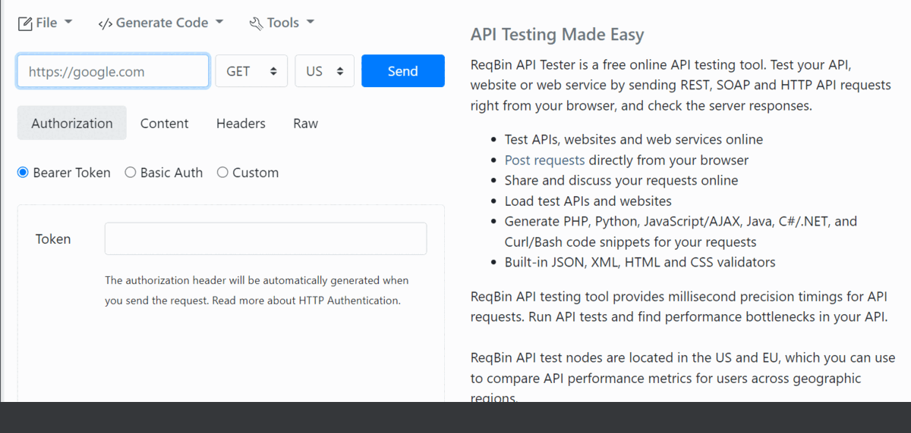

# SE-ConvLua-Group24
---


[](https://github.com/devanshi39/SE-Project-Group24/issues)


[](https://doi.org/10.5281/zenodo.7071769)

[](https://codecov.io/gh/devanshi39/SE-Project-Group24/branch/main)

ConvLua is a homework project repository for Group 24's CSC 510, Software Engineering Class. The folders are organized in the following manner:
LUA HW3 contains all of the primary directories and files. It contains the following files and folders: 
It contains the following files and folders: 

1. code: This directory contains all of the.py files that declare the LUA classes in Python. Some examples include cols class.py, data class.py, row class.py, and so on.
2. data: This directory contains the homework dataset, "auto 93.csv." The data is in the format of a csv file. 
3. tests: This directory contains the primary testing file, testEngine.py, as well as the init.py file.
4. README.md: This is the README.

### Installation

1. Get a free API Key at [https://example.com](https://example.com)
2. Clone the repo
   ```sh
   git clone https://github.com/github_username/repo_name.git
   ```
3. Install NPM packages
   ```sh
   npm install
   ```
4. Enter your API in `config.js`
   ```js
   const API_KEY = 'ENTER YOUR API';
   ```
---

# How to use

## Run the app
```bash
npm run start
```
## Send a GET request

- send a simple GET request using [https://reqbin.com/](https://reqbin.com/)
 1. Type localhost url - *http://127.0.0.1:3005*
 2. Select GET method from dropdown
 3. Click on *SEND*



## Credits
---
This software uses the following open source packages:
- Node.js
- Express
- dotenv


<p align="right">(<a href="#readme-top">back to top</a>)</p>
